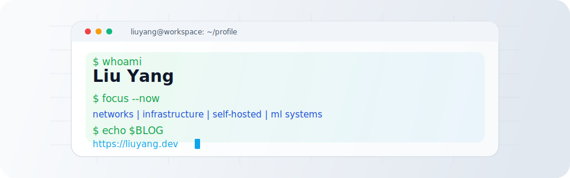

  <picture>
    <source media="(prefers-color-scheme: dark)" srcset="./assets/terminal-hero.svg" />
    <source media="(prefers-color-scheme: light), (prefers-color-scheme: no-preference)" srcset="./assets/terminal-hero-light.svg" />
    
  </picture>

  
  

  Graduate student focused on time series analysis and LLM agents, with previous work in full-stack web development and computer vision.

## About Me

- Graduate student with a background in web development, computer vision, and practical infrastructure tooling.
- During undergraduate studies, I mainly worked on frontend and backend web development, along with image segmentation and face-related algorithms.
- I enjoy building automation that improves everyday computing workflows and keeps systems simple to operate.

## Current Focus

- Time series analysis
- LLM agents
- Computer networking, self-hosted services, and personal infrastructure
- End-to-end connectivity, stability, and bandwidth efficiency

## Tech Stack

  
  
  
  
  

  
  
  
  
  
  
  
  

- Languages: Python, Java, C (basic), Go (basic), SQL
- Frontend: Vue (basic), React (basic)
- ML: PyTorch
- Systems: Linux, Shell scripting, Cloud infrastructure, Docker, Git, WSL, OpenWRT

## Interests

- Amateur algorithm competitor
- CTF player focused on Web and Reverse Engineering
- Enthusiastic about computer networking
- Self-hosted services lover

## Philosophy

Passionate about computer networks and infrastructure.

I enjoy building tools and automation that improve everyday computing workflows, especially systems that enhance **end-to-end connectivity, stability, and bandwidth efficiency**.

I am also interested in **self-hosted systems and personal infrastructure**.

## Featured Projects

| Project | Description | Stack |
| --- | --- | --- |
| [openconnect-ssh](https://github.com/imYangliu/openconnect-ssh) | Lightweight SSH wrapper for AnyConnect/OpenConnect environments with automatic VPN recovery, split tunneling, and reverse port forwarding. | Shell, SSH, OpenConnect |
| [Diff-UNet](https://github.com/imYangliu/Diff-UNet) | Diffusion-embedded network for 3D medical image segmentation, with support for BraTS2020 and BTCV workflows. | Python, PyTorch |
| [AnnounceChat](https://github.com/imYangliu/AnnounceChat) | Announcement-oriented QA and prompt-engineering experiments, including dataset preprocessing pipelines. | Python, Jupyter |

## GitHub Stats

  <picture>
    <source
      media="(prefers-color-scheme: dark)"
      srcset="https://github-readme-stats.vercel.app/api?username=imYangliu&show_icons=true&include_all_commits=true&rank_icon=github&bg_color=0b1220&title_color=e5e7eb&text_color=94a3b8&icon_color=22c55e&border_color=1f2937"
    />
    <source
      media="(prefers-color-scheme: light), (prefers-color-scheme: no-preference)"
      srcset="https://github-readme-stats.vercel.app/api?username=imYangliu&show_icons=true&include_all_commits=true&rank_icon=github&bg_color=f8fafc&title_color=111827&text_color=475569&icon_color=2563eb&border_color=e2e8f0"
    />
    
  </picture>
  <picture>
    <source
      media="(prefers-color-scheme: dark)"
      srcset="https://github-readme-stats.vercel.app/api/top-langs/?username=imYangliu&layout=compact&langs_count=6&bg_color=0b1220&title_color=e5e7eb&text_color=94a3b8&border_color=1f2937"
    />
    <source
      media="(prefers-color-scheme: light), (prefers-color-scheme: no-preference)"
      srcset="https://github-readme-stats.vercel.app/api/top-langs/?username=imYangliu&layout=compact&langs_count=6&bg_color=f8fafc&title_color=111827&text_color=475569&border_color=e2e8f0"
    />
    
  </picture>

## Find Me

- Blog: [liuyang.dev](https://liuyang.dev) (formerly `linu.me`)
- GitHub: [@imYangliu](https://github.com/imYangliu)
- Open to collaborating on infrastructure tooling, web projects, and applied ML systems
