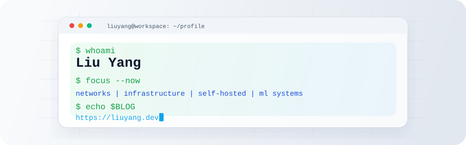

  <picture>
    <source media="(prefers-color-scheme: dark)" srcset="./assets/terminal-hero.svg" />
    <source media="(prefers-color-scheme: light), (prefers-color-scheme: no-preference)" srcset="./assets/terminal-hero-light.svg" />
    
  </picture>

  
  
  

Hi, I'm Liu Yang — a master's student at ECNU working on **LLM agents**.
I like building the plumbing around them: notifiers, workflow runners, CLIs,
and the network tooling that keeps remote dev boxes reachable.

### 🔨 Things I've built

| | Project | What it does |
| --- | --- | --- |
| 🔔 | [wsl-agent-notify](https://github.com/imYangliu/wsl-agent-notify) | Windows toast notifications when Claude Code / Codex finishes work inside WSL |
| 🌐 | [openconnect-ssh](https://github.com/imYangliu/openconnect-ssh) | Rust SSH wrapper for AnyConnect/OpenConnect networks with auto VPN recovery, split tunneling, and reverse port forwarding |
| 🏆 | [taac2026-cli](https://github.com/imYangliu/taac2026-cli) | Terminal client for Tencent's Taiji platform, built for TAAC 2026 (KDD Cup) |
| 🌱 | [typing_farmer_mac](https://github.com/imYangliu/typing_farmer_mac) | macOS menu-bar farm that grows crops from your keystrokes — an AI-assisted gamedev experiment |

### ✍️ Recent writing

<!-- BLOG-POST-LIST:START -->- [playwright-cli：为任何 Code Agent 接入目前最快的 Browser-Use 能力](https://liuyang.dev/posts/agent/resume-applications-playwright-cli-skills/)
- [值得长期关注的 Agent 技术博客](https://liuyang.dev/posts/agent/agent-technical-blogs/)
- [虚拟化扫盲笔记：Container、KVM、QEMU 到 Firecracker](https://liuyang.dev/posts/linux/hypervisor/)
- [LangAC：实训项目复盘——一个「零 SQL」的英语学习平台](https://liuyang.dev/posts/dev/langac-internship-project/)
- [Tailscale + 无线 ADB：在任何地方远程调试 Android 设备](https://liuyang.dev/posts/dev/remote-android-debug/)
<!-- BLOG-POST-LIST:END -->

➡️ More at [liuyang.dev](https://liuyang.dev)

### 🧰 Daily drivers

Python · Rust · TypeScript · PyTorch · Linux · Docker · OpenWrt · Claude Code / Codex

Currently: agent harnesses & evals · Previously: full-stack web, medical image segmentation
